

<h1 align='center'>
    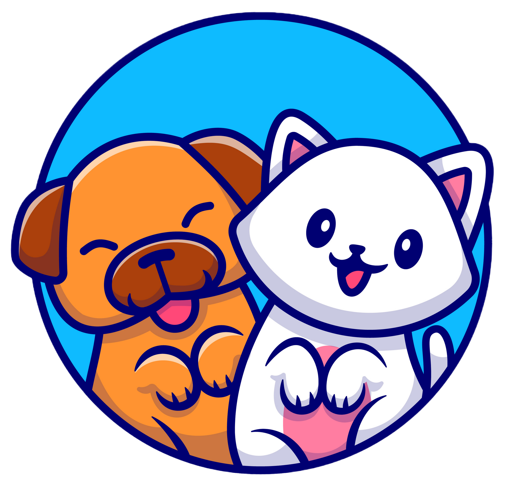
</h1>
<h2 align='center' >ADO.TE</h2>

<!--BADGE LICENÇA -->
    
<!-- BADGE REPO SIZE -->
    
 <!-- CODE SIZE BADGE -->

<!-- BADGE TOP LANGUAGE -->
    

<!-- SUMÁRIO / TABELA DE CONTEÚDOS -->

    
Sumário

    <ol>
        <li><a href="#pushpin-sobre">Sobre</a></li>
        <li><a href="#hammer_and_wrench-funcionalidades">Funcionalidades</a></li>
        <li><a href="#wrench-tecnologias-e-recursos-utilizados">Tecnologias e recursos utilizados</a></li>
        <li><a href="#camera-screenshots-do-projeto">Screenshots do Projeto</a></li>
        <li><a href="#woman_technologist-a-desenvolvedora">A desenvolvedora</a></li>
    </ol>

## :pushpin: Sobre
ADO.TE é uma plataforma que visa integrar pessoas que tem pets para colocar pra adoção de pessoas que querem adotar.

Esse projeto foi desenvolvido durante a <a href="https://pythonando.com.br/psw/inscricao/pl">PyStack Week - o retorno</a>, que aconteceu entre os dias 09 e 15 de janeiro de 2023 e que contou com três aulas práticas de desenvolvimento de projeto bem como de lives de aquecimento para a semana, além de acesso à comunidade exclusiva do evento para interação, solução de dúvidas e networking.

<!-- BOTÃO PARA VOLTAR AO TOPO DA PÁGINA -->

## :hammer_and_wrench: Funcionalidades

- [x] Autenticação (cadastro e login);
- [x] Integração com banco de dados;
- [x] Apresentação dos dados em um dashboard;
- [ ] Tornar as páginas responsivas e melhorar o layout;

<!-- BOTÃO PARA VOLTAR AO TOPO DA PÁGINA -->

## :wrench: Tecnologias e recursos utilizados
- [Python](https://www.python.org)
- ~~Welcome to the~~ [Django](https://www.djangoproject.com)
- [SQLite3](https://www.sqlite.org/index.html)
- [HTML](https://developer.mozilla.org/en-US/docs/Web/html)
- [CSS](https://developer.mozilla.org/en-US/docs/Web/css)
- [JavaScript](https://developer.mozilla.org/en-US/docs/Web/JavaScript)
- [Chart.js](https://www.chartjs.org)
- [Bootstrap](https://getbootstrap.com/docs/4.0/components/alerts/)

<!-- BOTÃO PARA VOLTAR AO TOPO DA PÁGINA -->

## :camera: Screenshots do projeto

<h3>Telas de login e cadastro</h3>

    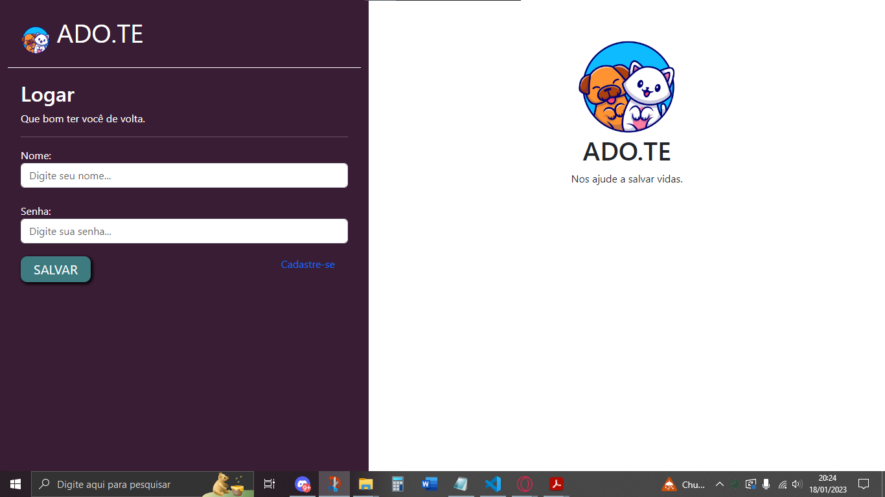
    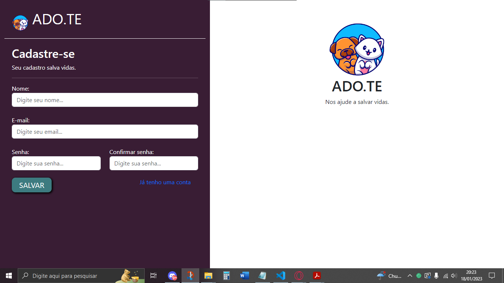

<h3>Buscar pets por cidade e/ou raça</h3>

    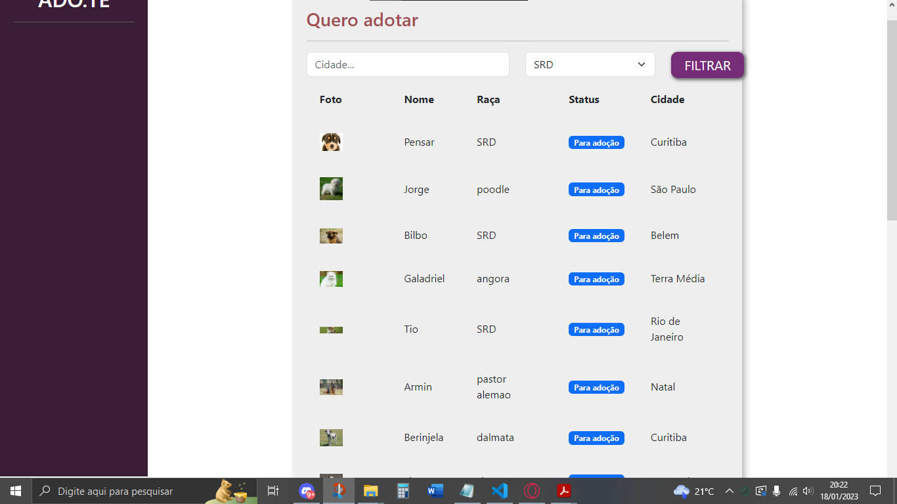

<h3>Ver mais informações sobre o pet</h3>

    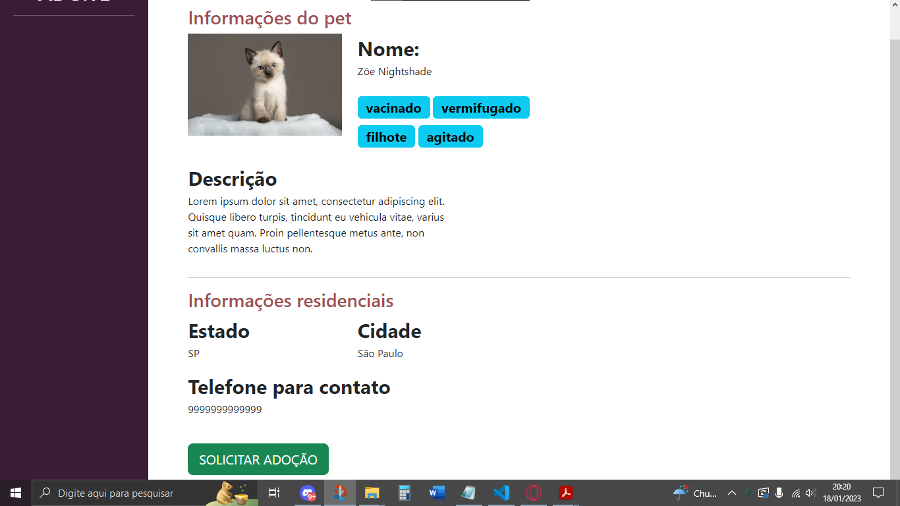

<h3>Cadastrar novo pet</h3>

    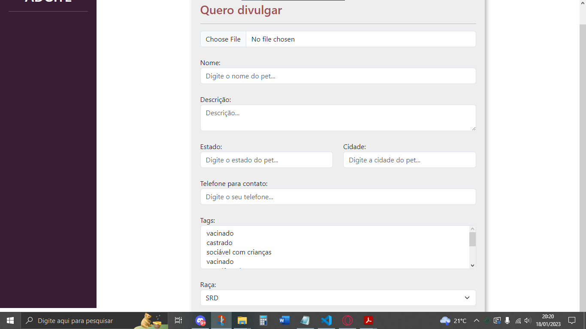

<h3>Ver os seus pets cadastrados</h3>

    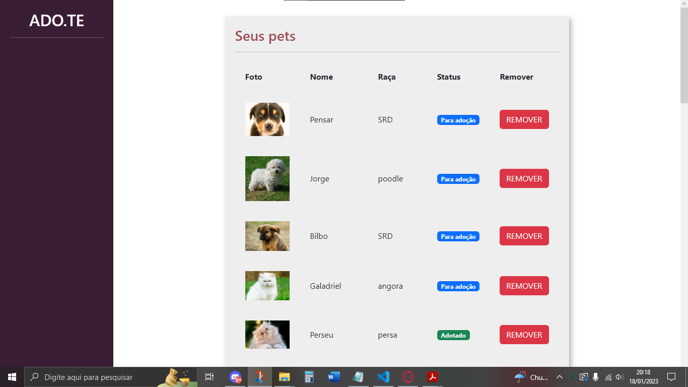

<h3>Mensagens de erro do sistema</h3>

    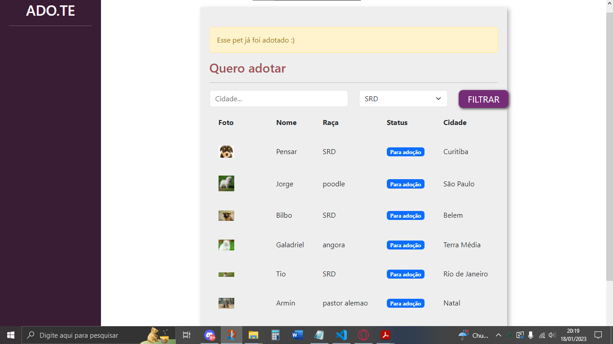

<h3>Ver solicitações de adoção<h3>

    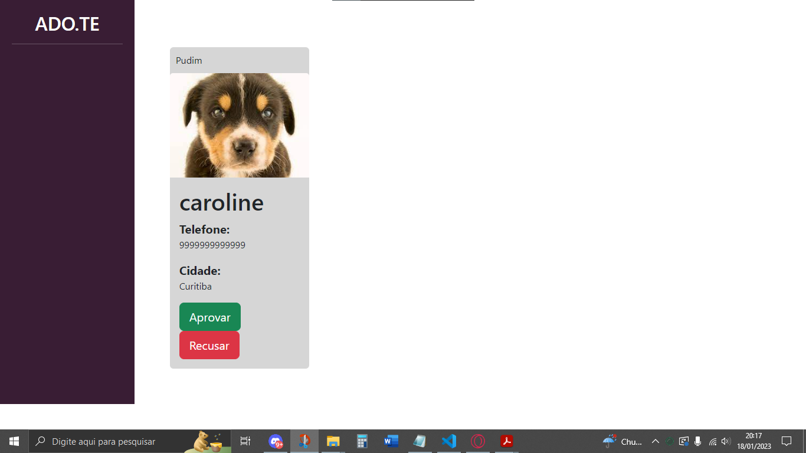

<h3>Acesso do administrador do sistema</h3>

    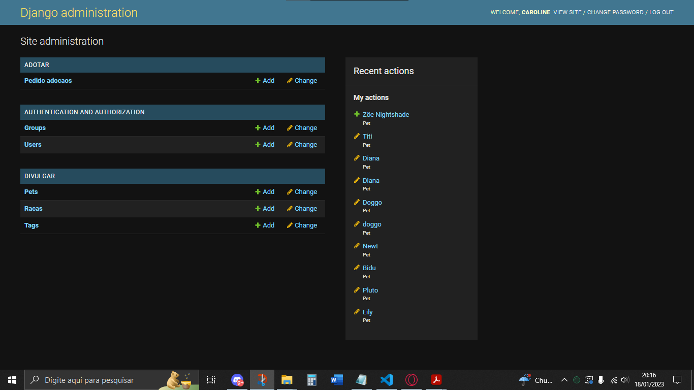

<h3>Dashboard demonstrando as adoções por raça</h3>

    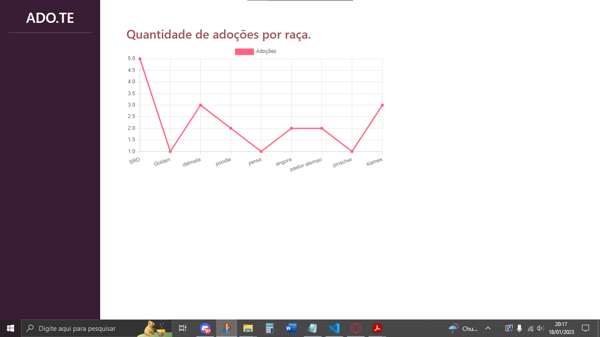

<!-- BOTÃO PARA VOLTAR AO TOPO DA PÁGINA -->

## :woman_technologist: A desenvolvedora

 
<strong>Caroline Heloíse de Oliveira</strong>
 
Estudante de Engenharia de Computação (UEPG)
 

<!-- BOTÃO PARA VOLTAR AO TOPO DA PÁGINA -->

